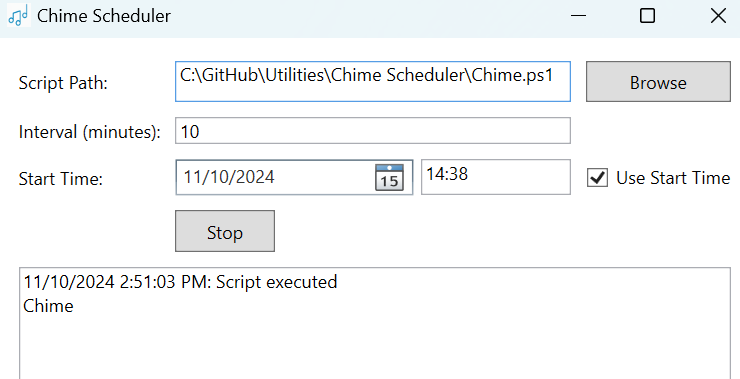
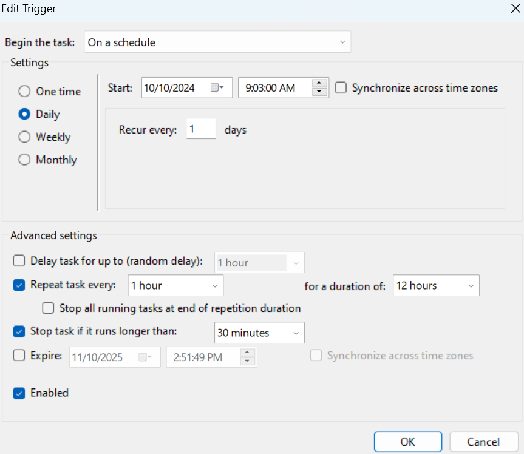

# Chime Scheduler

Chime Scheduler runs a PowerShell script on Windows at specified
intervals. The included script plays a sound—hence the name “Chime”—but
it can run any PowerShell script. The project offers two solutions:

1.  Windows Desktop Application – Simple and user-friendly, providing
    core scheduling features.

2.  Windows Task Scheduler – Offers greater customization and
    flexibility.

## Use Chime Scheduler Windows App

The app `Chime Scheduler.exe` can be found in the `Chime Scheduler.zip`
root folder. It runs a PowerShell Script at a certain interval (in
minutes).

Users can minimize the application to a tray when it is running and wait
in the background.

## Use Windows Task Scheduler

For more customized scheduling use Windows Task Scheduler to run the
PowerShell script

1.  Go to Task Scheduler

2.  Select Action - Create Task - General

    - In Security options, select “Run whether user is logged on or not”

3.  Go to Triggers and select New...

    - In settings select Daily,

    - In advanced settings, check Repeat task every 1 hour for a
      duration of 12 hours.

    - Click Ok.

>  style="width:5.32532in;height:4.61581in"
> alt="图形用户界面, 文本, 应用程序, 电子邮件 描述已自动生成" />

4.  Go to Actions and select New...

    - In Settings - Program/script, type `powershell.exe`

    - In Settings - Add arguments, type `-WindowStyle hidden -File`
      `C:\path\to\HourlyChime.ps1`

      - `-WindowStyle hidden` hides the powershell window

5.  Go to Settings

    - Check Run task as soon as possible after a scheduled start is
      missed

## Chime.ps1

The ps1 script plays a sound file locating at
'C:\Windows\Media\Alarm03.wav'. Change the sound file location in the
file as desired.
